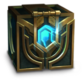
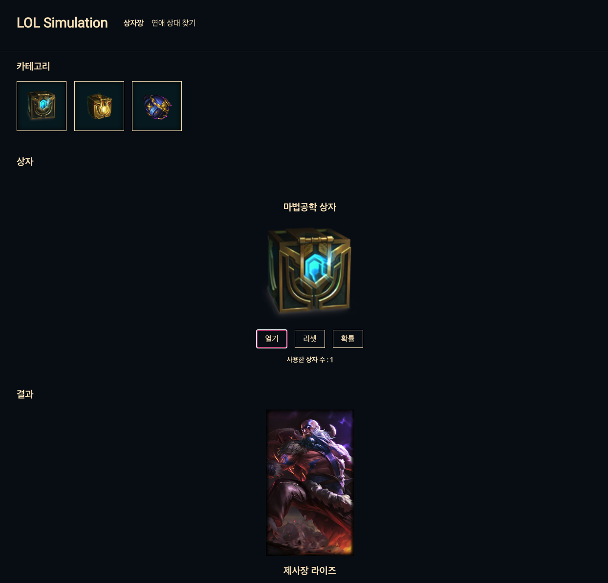

<a name="readme-top"></a>

<!-- PROJECT LOGO -->
<br />
<div align="center">
  <!-- <a href="https://github.com/othneildrew/Best-README-Template"> -->
    
  <!-- </a> -->

  <h3 align="center">LOL-Simulation</h3>

  <p align="center">
   롤 상자깡 시뮬레이션
    <br />
    <a href="https://lol-simulation.site"><strong>배포 링크</strong></a>
    <br />
    <br />


<!-- ABOUT THE PROJECT -->
## About The Project

 


</br>
마법공학 상자를 마음껏 열어볼 수 있는 롤 시뮬레이션 사이트입니다. 


</br>
</br>
</br>

## Stack

[![Next][Next.js]][Next-url]  
[![TypeScript][TypeScript]][TypeScript-url]  
[![Styled-Components][StyledComponents]][StyledComponents-url]


</br>
</br>


<!-- GETTING STARTED -->
## Getting Started

  ```sh
  yarn install
  yarn dev
  ```
<!-- USAGE EXAMPLES -->


<!-- MARKDOWN LINKS & IMAGES -->
<!-- https://www.markdownguide.org/basic-syntax/#reference-style-links -->
[Next.js]: https://img.shields.io/badge/next.js-000000?style=for-the-badge&logo=nextdotjs&logoColor=white
[Next-url]: https://nextjs.org/
[TypeScript]: https://img.shields.io/static/v1?style=for-the-badge&message=TypeScript&color=3178C6&logo=TypeScript&logoColor=FFFFFF&label=
[TypeScript-url]: https://www.typescriptlang.org/
[StyledComponents]: https://img.shields.io/badge/styledcomponents-DB7093?style=flat-square&logo=styled-components&logoColor=white
[StyledComponents-url]: https://styled-components.com/
